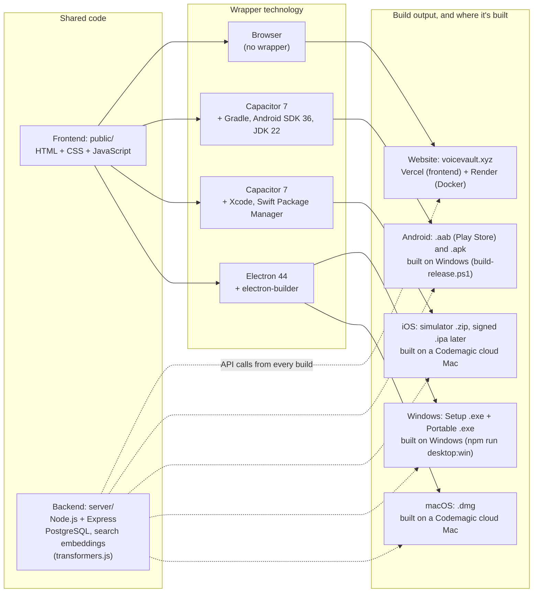

## Session summary

- **Auto-sync**: the app's saved-notes list now refreshes on its own (every 15 s and when returning to the app) when notes change on the website or localhost — no relaunch needed. Paused while searching, editing, or playing audio.
- **Target Android 16**: compile/target SDK raised to API 36 for Google Play.
- **Signing key**: created `android-signing\notevault-upload.jks` + `keystore.properties` and wired release signing into Gradle; folder is git-ignored and must be backed up.
- **Release build**: new `build-release.ps1` produces `release\NoteVault-release.aab` (Play upload) and `release\NoteVault-release.apk` (direct install), both signature-verified; version 1.0 (code 1).
- **Reports**: renamed the copied voiceVault reports to `NoteVault_*.md` and rewrote them for the Android app.
- **Screenshots**: captured 5 emulator screenshots into `screenshots/` (home, expanded note, search, new note, help) and added them to the reports.
- **Bar spacing fix**: content no longer runs under the status bar / navigation bar (native margins + 5 px app-only padding + matching bar colour); screenshots retaken after the fix.
- **First-search speed**: backend now warms the embedding model on start, the Docker image includes the model, and chunks are embedded after transcription before the note is saved as ready (web commit `e44a5b0`, pushed; copied here).
- **GitHub**: pushed to private repo `1218Anubhavmishra/NoteVault` (README marks it as the app version of voiceVault; signing key, `.env`, APK/AAB excluded).
- **Repo public**: `1218Anubhavmishra/NoteVault` is now public.
- **iOS platform**: installed `@capacitor/ios` 7.6.9, added `ios/` (Swift Package Manager, bundle id `xyz.voicevault.app`), microphone usage text in `Info.plist`, `npm run cap:sync:ios`. Build needs a Mac / Codemagic.
- **Electron**: installed Electron 44; `electron/main.cjs` serves `public/` at `https://localhost` so the live backend works unchanged; `npm run desktop` opens the desktop app (login screen verified).
- **Codemagic**: connected to `1218Anubhavmishra/NoteVault`; added `codemagic.yaml`. First `ios-simulator-build` run succeeded (Mac mini M2, ~1.5 min, artifact `NoteVault-simulator.zip` 1.56 MB). `ios-release` still needs an Apple Developer account + App Store Connect key.
- **iOS live testing**: Appetize rejected (free plan 30 min/month, 3-min sessions, browser only). Added `ios-simulator-vnc` Codemagic workflow: builds, boots an iPhone simulator, installs + launches NoteVault, then waits up to 30 min for a VNC connection (uses Codemagic's 500 free M2 minutes/month).
 - **iOS login fixes**: form fields are 16px on touch screens (iOS was zooming in on focus, making the login card look oversized and cut off). Login failed with AUTH_REQUIRED because WKWebView blocked the `api.voicevault.xyz` session cookie as third-party; the iOS app now loads from `capacitor://app.voicevault.xyz` (`ios-config.mjs`, run by `npm run cap:sync:ios`), added to `WKAppBoundDomains` and the server CORS allowlist.
 - **2026-10-01 builds**: rebuilt the signed Android release (AAB + APK) and debug APK with all fixes; collected everything in `builds/` (git-ignored, see `builds/README.txt`). Added electron-builder: `npm run desktop:win` makes a Windows installer and portable .exe (unsigned); new Codemagic workflow `macos-desktop` makes an unsigned universal macOS .dmg.
 - **Reminders**: take the login screenshot when it next appears; test panel × buttons on a physical phone.
- **Still to do before Play launch**: in-app account deletion, privacy policy, Data safety form, custom app icon + store graphics.

## Technology and build map (2026-10-01)

The voiceVault website and the NoteVault apps share one frontend (`public/`) and one backend (`api.voicevault.xyz`). Each build wraps the same frontend with a different technology. The app wrappers (Capacitor, Electron) live in the NoteVault project (`D:\Projects\NoteVault`, GitHub `1218Anubhavmishra/NoteVault`).

