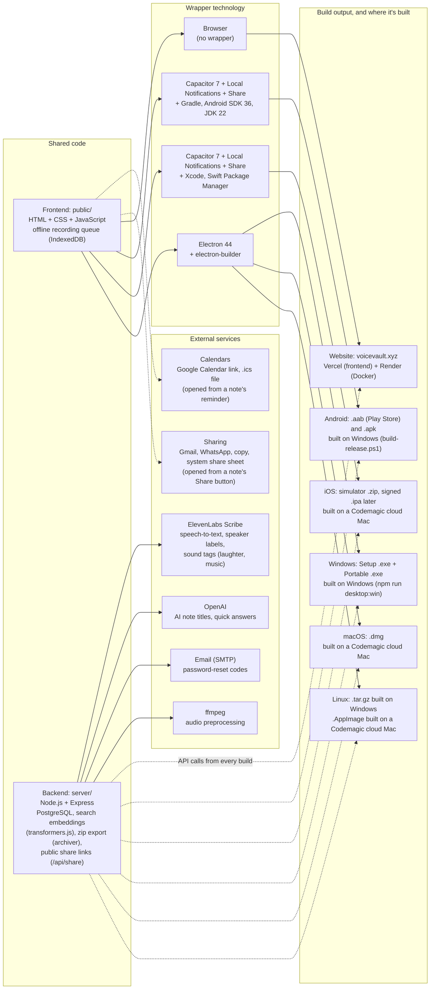

## Project setup (Android app)

- **New project**
  - Copied the voiceVault web project to `D:\Projects\NoteVault` (originally `voiceVault-android`, renamed to NoteVault).
  - Added Capacitor 7 with the Android platform; app id `xyz.voicevault.app`, app name **NoteVault**, web assets from `public/`.
  - `capacitor.config.json`: `androidScheme: https`, navigation allowed to `*.voicevault.xyz`.
- **Android configuration**
  - Added `RECORD_AUDIO` and `MODIFY_AUDIO_SETTINGS` permissions.
  - App name set to NoteVault in `strings.xml`; `local.properties` points to the Android SDK.
  - Login screen text changed to NoteVault.
- **Scripts**
  - `build-android.ps1`: sets JAVA_HOME (JDK 22) and SDK paths, syncs, builds debug APK with `--no-daemon`.
  - `start-emulator.ps1`: starts `flutter_emulator` with `-gpu swiftshader_indirect -no-snapshot-load -no-boot-anim`.
  - `install-sideload.ps1`: waits for `sys.boot_completed` **and** the package service before installing, then launches.
  - `launch-on-emulator.ps1`: install-if-missing + launch.

## Backend fixes (made in the web project and pushed; copied here)

- **Render database recovery**: old Postgres was deleted (ENOTFOUND); new Render Postgres (Singapore) created and `DATABASE_URL` updated in both `.env` files and on Render.
- **Android login (`AUTH_REQUIRED`)**
  - Session cookie becomes `SameSite=None; Secure` + `trust proxy` only when `VOICEVAULT_CROSS_SITE_COOKIES=1` (set on Render; local http dev unaffected).
  - CORS restricted to an allowlist (voicevault.xyz domains, `https://localhost`, local dev) plus optional `VOICEVAULT_CORS_ORIGINS`.
  - Documented both variables in `.env.example`.
- **Empty library box**: "No saved notes yet" box restored to a light background with dark text.
- **Speaker labels and sound tags (2026-10-02)**: note transcription asks ElevenLabs Scribe for speakers (`diarize`) and sound tags (`tag_audio_events`). Transcripts are written as "Speaker N: …" lines, each segment stores its speaker (new `note_segments.speaker` column), and speakers can be renamed in the "Speakers" box after Full preview or in Edit mode (`PATCH /api/notes/:id` with `speakers`).
- **Titles (2026-10-02)**: automatic titles skip speaker labels and sound tags and end with the detected speakers ("Topic - Speaker 1, Speaker 2"); renaming a speaker updates the title.
- **Account deletion (2026-10-02)**: Profile → Delete account; `POST /api/auth/delete-account` checks the password, deletes all the user's data and audio, and signs out. Other devices are signed out because `requireUser` checks the account still exists.
- **MP4 fallback (2026-10-02)**: recording falls back to MP4/AAC when WebM isn't supported; files are named `.m4a`. In this project the audio download keeps using `vvApiUrl()`.
- **Login limit (2026-10-02)**: 3 failed logins per email, then a 30 s block (HTTP 429 `too_many_attempts` with `retry_after`), repeating; the login form counts down. Also applied to the reset code and the delete-account password.
- **Offline recording (2026-10-02)**: offline saves go to IndexedDB and upload through `POST /api/notes` when the connection returns (also every 60 s and at login). The last session user is cached so the app can open offline.
- **Reminders (2026-10-02)**: new `notes.reminder_at` column and `GET /api/reminders`; notes offer a Google Calendar link and an `.ics` file. The apps schedule phone notifications with `@capacitor/local-notifications` (added to `package.json`, synced to Android and iOS).
- **Export (2026-10-02)**: `GET /api/export/notes.zip` (`archiver`) with title-named `.txt` and audio files; the Profile button uses `vvApiUrl()` here.
- **Search highlight, Newest label, job titles (2026-10-02)**: searched words are highlighted directly (the "eyes" bug); the newest note shows a "Newest" label; background-job titles strip speaker labels read from the transcript.

## App-specific frontend fixes

- **Notes stuck on "Displaying Saved Notes…"**
  - `main.js` built API URLs from `window.location.origin` (`https://localhost` in the app), so requests never reached the backend.
  - Added `VV_API_PREFIX`, `VV_API_ORIGIN`, and `vvApiUrl()`; notes, semantic search, jobs, stop-all, audio, avatar, and download URLs now use the backend.
  - `mobile-api.js` also rewrites absolute `https://localhost/api/...` URLs.
- **Auto-sync without relaunch**
  - Every 15 s and on returning to the app, fetches `/api/notes`, compares id/updated_at/status/favorite, and re-renders only on change.
  - Skipped while searching, editing a note, or playing audio; only active inside the app.

- **Status / navigation bar spacing (Android 15+ edge-to-edge)**
  - `capacitor.config.json`: `android.adjustMarginsForEdgeToEdge: "auto"` — the WebView stops exactly at the system bars on any device.
  - Theme: cream background (`#F4EFE4`, same as the page) behind the bars, with dark status/navigation icons (`colors.xml`, `styles.xml`).
  - `mobile-api.js` adds a `vv-native-app` class; `styles.css` adds 5 px extra top/bottom page padding in the app only (website unchanged).
- **Build script**: `build-android.ps1` now stops when Gradle fails (previously it reported success and kept the old APK).
- **Share a note (2026-10-07)**
  - Share links point at `https://www.voicevault.xyz/api/share/<token>` in the apps (the app's own origin is `https://localhost`); `window.VV_API_BASE` from `mobile-api.js` decides this.
  - `@capacitor/share` (7.0.4) provides More… (the system share sheet) on Android and iOS.
  - Gmail and WhatsApp links open in the system: Electron passes `window.open` to the default browser, and the Capacitor apps navigate to the link so Android/iOS hand it to WhatsApp or Gmail.

## Release preparation (Google Play)

- Target / compile SDK raised from 35 to **36** (Play requirement).
- Created upload key `android-signing\notevault-upload.jks` + `keystore.properties`; wired into `android\app\build.gradle` release signing.
- `.gitignore`: ignores `android-signing/`, `release/`, `*.jks`, `*.keystore`.
- `build-release.ps1`: builds signed `release\NoteVault-release.aab` and `release\NoteVault-release.apk`; signatures verified.

## Technology and build map (2026-10-01)

The voiceVault website and the NoteVault apps share one frontend (`public/`) and one backend (`api.voicevault.xyz`). Each build wraps the same frontend with a different technology. The app wrappers (Capacitor, Electron) live in the NoteVault project (`D:\Projects\NoteVault`, GitHub `1218Anubhavmishra/NoteVault`). The backend calls **ElevenLabs Scribe** to turn recorded audio into text (word timestamps, language detection, who spoke each line, and sound tags such as laughter or music; `server/elevenlabs-stt-vv.js`, key `ELEVENLABS_API_KEY`). A local faster-whisper model is an optional alternative (`VOICEVAULT_STT_PROVIDER=whisper`). OpenAI generates note titles and quick answers when `OPENAI_API_KEY` is set, SMTP email sends password-reset codes, and ffmpeg prepares audio before transcription. Search embeddings run locally on the server (transformers.js), so search needs no external API.

