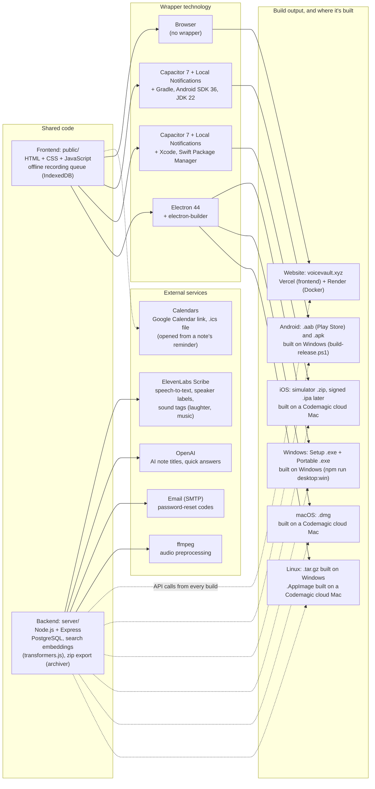

## 2026-10-02 (later): login limit, offline recording, reminders, export, search fix, tidy-up

The same changes were made in voiceVault (shared frontend and backend) and copied here.

- **Login limit**: after 3 wrong passwords for an email, login is blocked for 30 seconds, then a fresh round of 3 attempts starts. The error says how many attempts are left, and the login form counts down while blocked. The same limit covers the password-reset code and the delete-account password.
- **Record without internet**: with no connection, Save keeps the recording on the device (IndexedDB) and a banner shows how many are waiting. They upload and transcribe on their own when the connection returns. The app opens offline using the last signed-in user, so it needs one earlier online login.
- **Reminders and calendar**: a note can have a reminder date and time (new note form and Edit mode). The note shows "Add to Google Calendar" and "Download .ics". In the Android and iOS apps the phone shows a notification at that time, using the new `@capacitor/local-notifications` plugin (inexact alarms, so it may be a few minutes late). Desktop apps offer the calendar link and `.ics` only.
- **Export all notes**: Profile has an "Export all notes" button beside Edit. It downloads one `.zip` with each note's transcript (`.txt`) and audio, named after the note title. In this project the link uses `vvApiUrl()`.
- **"Eyes" search fix**: search now highlights the searched words themselves instead of a trimmed part of the segment, which cut off words at the edges (such as "eyes").
- **Newest label**: the most recently created note has a "Newest" label at the bottom right of its card. The order of notes is unchanged.
- **Titles from the background job**: speaker labels are also read from the transcript lines, so job-processed notes get "Topic - Speaker 1" titles.
- **Error text**: login and form errors are dark red (they were very faint pink).
- **Folders**: reports, `.docx` and `.txt` files are in `docs/`; screenshots and the chart image in `images/`.
- **Builds**: Android release + debug, Windows and Linux rebuilt with these changes; run the Codemagic workflows for iOS, macOS and the AppImage.

## 2026-10-02: speaker labels, sound tags, account deletion, MP4 fallback

The same changes were made in voiceVault (shared frontend and backend) and copied here.

- **Speaker labels**: note transcription now asks ElevenLabs Scribe to tell speakers apart (`diarize`). Each line of the transcript starts with "Speaker 1:", "Speaker 2:" and so on, and each saved segment remembers its speaker (`segments_json` and the new `note_segments.speaker` column). Search queries and the live preview are not labelled.
- **Renaming speakers**: after "Full preview" a "Speakers" box lists each speaker with an editable name (for example "Speaker 1" to "David"); the transcript updates as you type. Saved notes have the same box in Edit mode, and the server renames the speaker everywhere in the note (`PATCH /api/notes/:id` with `speakers`).
- **Titles**: automatic titles (AI or heuristic) are made from the transcript without speaker labels and sound tags, then list every detected speaker, for example "Project Deadline Plan - Speaker 1, Speaker 2". Renaming a speaker also renames it in the title, wherever the name appears (including older titles that start with "Speaker 1").
- **Sound tags**: Scribe also adds tags such as "(laughter)" or "(music)" to note transcripts (`tag_audio_events`). It doesn't name specific instruments.
- **In-app account deletion** (required by Google Play and the App Store): Profile has a "Delete account" section. After the password is confirmed, the account, all notes, drafts, folders, tags, saved searches, audio and the profile picture are removed and the app signs out. Sessions on other devices stop working.
- **MP4 recording fallback**: devices that can't record WebM/Opus (older iPhones) record MP4 (AAC) instead, uploaded as `.m4a`.
- **Builds**: Android release + debug, Windows and Linux rebuilt with these changes; run the Codemagic workflows for iOS, macOS and the AppImage.

## Session summary (2026-09-28 to 2026-10-01)

- **Auto-sync**: the app's saved-notes list now refreshes on its own (every 15 s and when returning to the app) when notes change on the website or localhost — no relaunch needed. Paused while searching, editing, or playing audio.
- **Target Android 16**: compile/target SDK raised to API 36 for Google Play.
- **Signing key**: created `android-signing\notevault-upload.jks` + `keystore.properties` and wired release signing into Gradle; folder is git-ignored and must be backed up.
- **Release build**: new `build-release.ps1` produces `release\NoteVault-release.aab` (Play upload) and `release\NoteVault-release.apk` (direct install), both signature-verified; version 1.0 (code 1).
- **Reports**: renamed the copied voiceVault reports to `NoteVault_*.md` and rewrote them for the Android app.
- **Screenshots**: captured 5 emulator screenshots into `images/` (home, expanded note, search, new note, help) and added them to the reports.
- **Bar spacing fix**: content no longer runs under the status bar / navigation bar (native margins + 5 px app-only padding + matching bar colour); screenshots retaken after the fix.
- **First-search speed**: backend now warms the embedding model on start, the Docker image includes the model, and chunks are embedded after transcription before the note is saved as ready (web commit `e44a5b0`, pushed; copied here).
- **GitHub**: pushed to `1218Anubhavmishra/NoteVault`, made public on 2026-09-29 (README marks it as the app version of voiceVault; signing key, `.env`, APK/AAB excluded).
- **Repo public**: `1218Anubhavmishra/NoteVault` is now public.
- **iOS platform**: installed `@capacitor/ios` 7.6.9, added `ios/` (Swift Package Manager, bundle id `xyz.voicevault.app`), microphone usage text in `Info.plist`, `npm run cap:sync:ios`. Build needs a Mac / Codemagic.
- **Electron**: installed Electron 44; `electron/main.cjs` serves `public/` at `https://localhost` so the live backend works unchanged; `npm run desktop` opens the desktop app (login screen verified).
- **Codemagic**: connected to `1218Anubhavmishra/NoteVault`; added `codemagic.yaml`. First `ios-simulator-build` run succeeded (Mac mini M2, ~1.5 min, artifact `NoteVault-simulator.zip` 1.56 MB). `ios-release` still needs an Apple Developer account + App Store Connect key.
- **iOS live testing**: Appetize rejected (free plan 30 min/month, 3-min sessions, browser only). Added `ios-simulator-vnc` Codemagic workflow: builds, boots an iPhone simulator, installs + launches NoteVault, then waits up to 30 min for a VNC connection (uses Codemagic's 500 free M2 minutes/month).
 - **iOS login fixes**: form fields are 16px on touch screens (iOS was zooming in on focus, making the login card look oversized and cut off). Login failed with AUTH_REQUIRED because WKWebView blocked the `api.voicevault.xyz` session cookie as third-party; the iOS app now loads from `capacitor://app.voicevault.xyz` (`ios-config.mjs`, run by `npm run cap:sync:ios`), added to `WKAppBoundDomains` and the server CORS allowlist.
 - **2026-10-01 builds**: rebuilt the signed Android release (AAB + APK) and debug APK with all fixes; collected everything in `builds/` (git-ignored, see `builds/README.txt`). Added electron-builder: `npm run desktop:win` makes a Windows installer and portable .exe (unsigned); new Codemagic workflow `macos-desktop` makes an unsigned universal macOS .dmg. `npm run desktop:linux` makes a Linux .tar.gz (the AppImage target needs Windows Developer Mode for symlinks).
 - **Reminders**: take the login screenshot when it next appears; test panel × buttons on a physical phone.
- **Still to do before Play launch**: privacy policy, Data safety form, custom app icon + store graphics (in-app account deletion was added on 2026-10-02).

## Technology and build map (2026-10-01)

The voiceVault website and the NoteVault apps share one frontend (`public/`) and one backend (`api.voicevault.xyz`). Each build wraps the same frontend with a different technology. The app wrappers (Capacitor, Electron) live in the NoteVault project (`D:\Projects\NoteVault`, GitHub `1218Anubhavmishra/NoteVault`). The backend calls **ElevenLabs Scribe** to turn recorded audio into text (word timestamps, language detection, who spoke each line, and sound tags such as laughter or music; `server/elevenlabs-stt-vv.js`, key `ELEVENLABS_API_KEY`). A local faster-whisper model is an optional alternative (`VOICEVAULT_STT_PROVIDER=whisper`). OpenAI generates note titles and quick answers when `OPENAI_API_KEY` is set, SMTP email sends password-reset codes, and ffmpeg prepares audio before transcription. Search embeddings run locally on the server (transformers.js), so search needs no external API.

