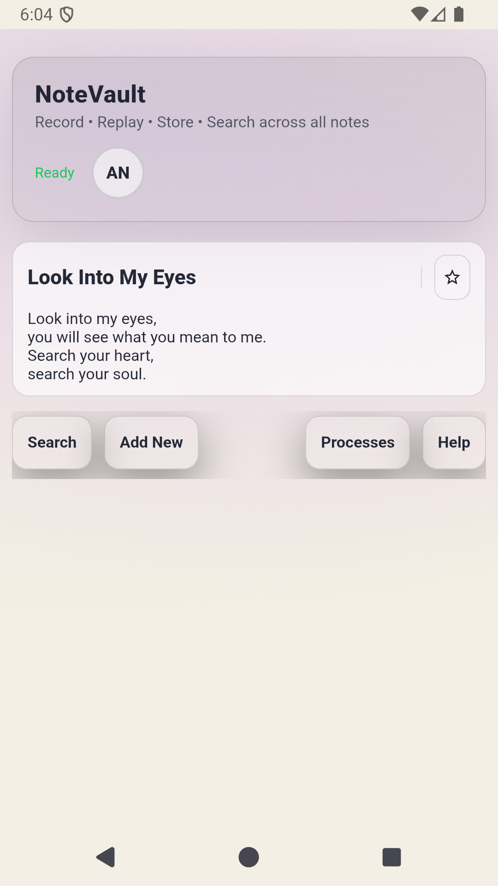
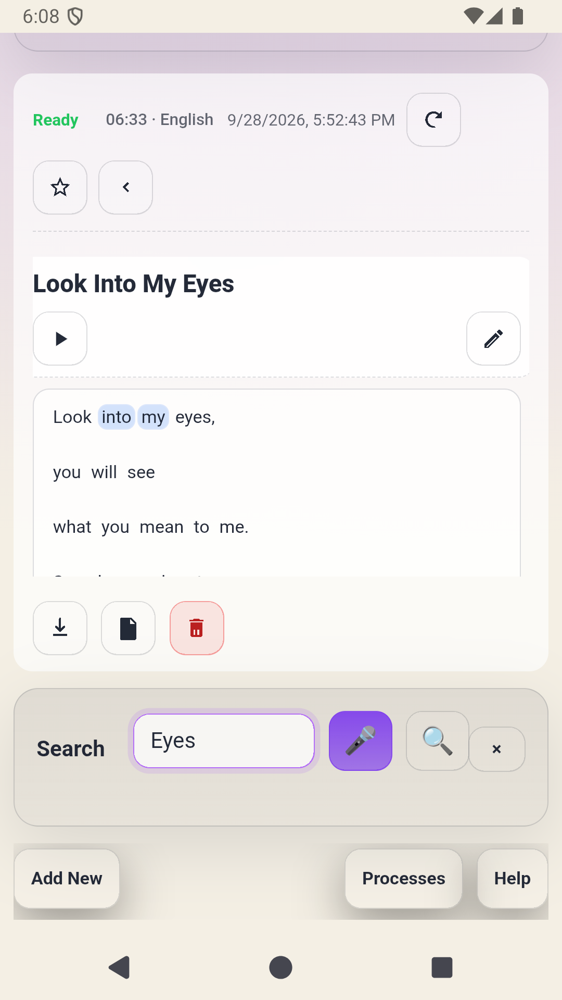
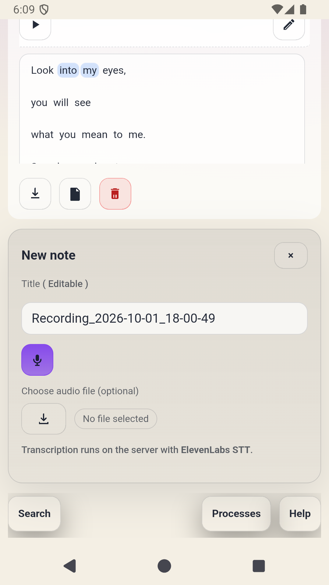
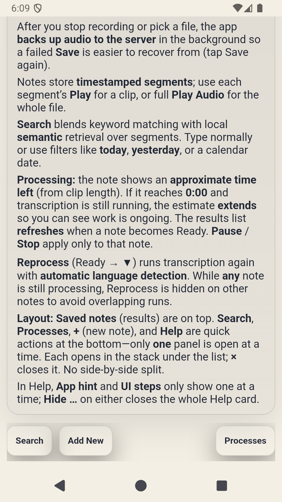
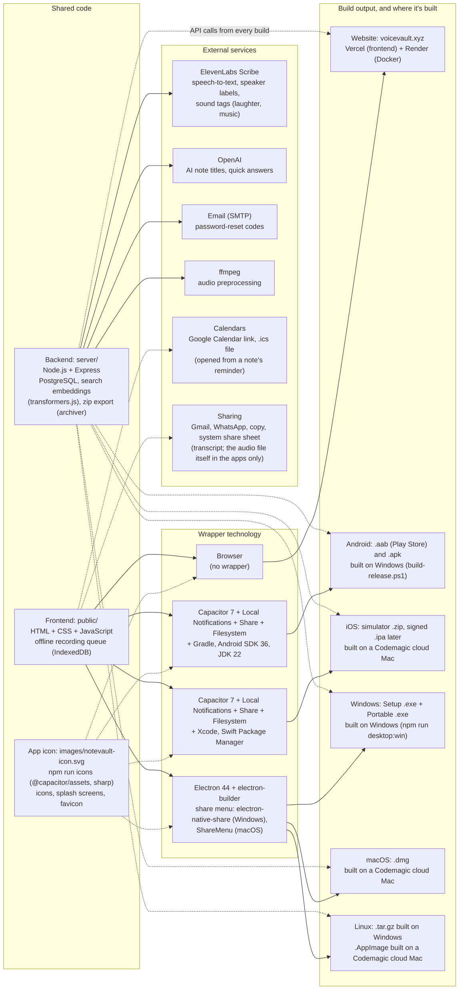

## 1) Executive summary

`NoteVault` is the **app version** of the voiceVault web app: **Android and iOS** via **Capacitor**, and **Windows, macOS and Linux** via **Electron**. It gives users the same experience as the website — record, transcribe, and search voice notes — using the **same account, data, and backend** (`https://api.voicevault.xyz` on Render).

The package id (`xyz.voicevault.app`) and backend URL were deliberately kept the same as planned for voiceVault, so the app and website stay in sync and Render needs no separate setup.

## 1.1) Screenshots (Android emulator, 2026-10-01)

Captured from the debug build running on the `flutter_emulator` virtual device (Android 15, 1080×1920), after the status/navigation bar spacing fix. Login screen: pending (see section 11).

| Saved notes (home) | Note expanded | Search result |
| :-: | :-: | :-: |
|  |  |  |

| New note | Help |
| :-: | :-: |
|  |  |

## 2) Scope (what it is / isn't)

- **Is**: A sideloadable and Play-Store-ready Android app wrapping the voiceVault UI, talking to the live Render backend.
- **Is not**: An offline app, a separate backend, or (yet) an iOS / desktop app.

## 3) How it relates to the voiceVault web project

| | voiceVault (web) | NoteVault (Android) |
| :-- | :-- | :-- |
| Location | `D:\Projects\voiceVault` | `D:\Projects\NoteVault` |
| Git | GitHub `1218Anubhavmishra/voiceVault` | GitHub `1218Anubhavmishra/NoteVault` (public) |
| Frontend host | Vercel (`www.voicevault.xyz`) | Inside the APK (`https://localhost` in the WebView) |
| Backend | Render (`api.voicevault.xyz`) | Same Render backend |
| Database | Render PostgreSQL | Same database |

Changes to the backend are made and pushed in the **web project**; NoteVault only changes the app shell and app-specific frontend code.

## 4) Current feature set

### Notes
- Record audio in the app (microphone permission) and save as a note.
- Recording uses WebM/Opus, or MP4/AAC on devices without WebM (older iPhones).
- Server-side transcription with timestamped segments; notes show `processing` → `ready` (or `error`).
- Speaker labels ("Speaker 1:", "Speaker 2:") and sound tags such as "(laughter)" or "(music)"; speakers can be renamed after Full preview and in Edit mode.
- Without internet, Save keeps the recording on the device; it uploads when the connection returns.
- Reminders: a date and time per note, with a phone notification (Android/iOS), "Add to Google Calendar" and an `.ics` file.
- The most recent note is marked "Newest" at the bottom right of its card.
- Share a note: Transcript, Audio or Both, by Copy, Gmail, WhatsApp or More… (system share sheet via `@capacitor/share`). Audio and Both send the audio file itself (saved with `@capacitor/filesystem`, shared through the share sheet; the Windows and Mac apps use the system share menu; the Linux app downloads it and opens Gmail or WhatsApp). Both adds the transcript. The website shares the transcript only.
- App icon: a note page where a sound wave turns into handwriting, with an amber pen and a vault badge on white, for the icon, splash screens and desktop apps (`npm run icons`).
- Play full audio or individual segments; download audio.
- Edit title/transcript, delete, retry; star and pin to the top.
- Folders, tags, saved searches.

### Search
- Text and voice search, hybrid keyword + semantic retrieval.
- Natural-language queries and date filters (`yesterday`, `last 3 days`, etc.).
- Quick answer box (extractive, or OpenAI when configured on the server).

### Accounts
- Register / login with email + password; forgot-password via email OTP.
- Profile name and avatar.
- Delete account (Profile, password required): removes the account, all notes, audio and the avatar, and signs out every device.
- Login limit: after 3 wrong passwords, a 30-second wait with a countdown, then 3 more tries.
- Export all notes (Profile, beside Edit): a `.zip` with each note's transcript and audio, named after the note title.

### App-specific
- **Auto-sync**: every 15 s (and on returning to the app) the note list is compared with the server and re-rendered only when changed; paused while searching, editing, or playing audio.
- **API routing**: all API calls, audio, avatar, and download URLs point at the live backend.

## 5) Architecture and data flow

- **App shell**: Capacitor 7; WebView loads `public/` from inside the APK at origin `https://localhost`.
- **`public/mobile-api.js`**: sets `window.VV_API_BASE = 'https://api.voicevault.xyz'` and rewrites `fetch('/api/...')` to that host.
- **`public/main.js`**: uses `VV_API_ORIGIN` / `vvApiUrl()` so absolute URLs also go to the backend.
- **Login cookie**: the backend sets `vv_session` as `SameSite=None; Secure` when `VOICEVAULT_CROSS_SITE_COOKIES=1` (set on Render), so the cookie works from the app's `https://localhost` origin. CORS allows only listed origins.

## 6) Tech stack

- Capacitor 7 (`@capacitor/core`, `@capacitor/android`, `@capacitor/cli`)
- Android SDK: compile/target API 36, min API 23; Android Gradle Plugin 8.7.2
- JDK 22 (`C:\Program Files\Java\jdk-22`)
- Backend: Node.js + Express, PostgreSQL, ElevenLabs / Whisper STT, optional OpenAI + Pinecone

### Technology and build map

The voiceVault website and the NoteVault apps share one frontend (`public/`) and one backend (`api.voicevault.xyz`). Each build wraps the same frontend with a different technology. The app wrappers (Capacitor, Electron) live in the NoteVault project (`D:\Projects\NoteVault`, GitHub `1218Anubhavmishra/NoteVault`). The backend calls **ElevenLabs Scribe** to turn recorded audio into text (word timestamps, language detection, who spoke each line, and sound tags such as laughter or music; `server/elevenlabs-stt-vv.js`, key `ELEVENLABS_API_KEY`). A local faster-whisper model is an optional alternative (`VOICEVAULT_STT_PROVIDER=whisper`). OpenAI generates note titles and quick answers when `OPENAI_API_KEY` is set, SMTP email sends password-reset codes, and ffmpeg prepares audio before transcription. Search embeddings run locally on the server (transformers.js), so search needs no external API.

## 7) Build, sign, install

| Script | Purpose |
| :-- | :-- |
| `start-emulator.ps1` | Start the `flutter_emulator` AVD (swiftshader GPU, no snapshot) |
| `build-android.ps1` | Sync web files + build `NoteVault-debug.apk` |
| `install-sideload.ps1` | Wait for full boot, install, launch |
| `launch-on-emulator.ps1` | Install if missing + launch |
| `build-release.ps1` | Signed `release\NoteVault-release.aab` + `.apk` |
| `npm run desktop:win` | Windows `NoteVault-Setup-<version>.exe` + `NoteVault-Portable-<version>.exe` in `builds\desktop` |
| `npm run desktop:linux` | Linux `NoteVault-<version>-linux-x64.tar.gz` in `builds\desktop` |
| `npm run cap:sync:ios` | Copy web files into `ios/` and set the iOS origin (`capacitor://app.voicevault.xyz`) |
| Codemagic workflows | iOS simulator `.zip`, iOS VNC live test, signed iOS `.ipa` (TestFlight), macOS `.dmg` + Linux `.AppImage` |

All current build files are collected in `builds\` (git-ignored); `builds\README.txt` lists each file.

**Signing**: `android-signing\notevault-upload.jks` + `keystore.properties` (password). Referenced by `android\app\build.gradle`. Ignored by `.gitignore`. **Back up both files off this PC.**

**Updates**: increase `versionCode` / `versionName` in `android\app\build.gradle` before each release build.

## 8) Test plan (quick)

- Log in with an existing web account → notes list matches the website.
- Record → save → note goes `processing` → `ready`.
- Delete / add a note on the website → app updates within ~15 s without relaunch.
- Play audio, play a segment, download audio.
- Log out / log in again.
- Save a note with two voices → "Speaker 1" / "Speaker 2" labels; rename one in Edit mode.
- Delete a test account from Profile → it can no longer log in.

## 9) Publishing checklist

### Google Play
- Play Console account ($25 one-time); new personal accounts need a 12-tester, 14-day closed test.
- Privacy policy URL; Data safety form (audio, email, notes).
- In-app account deletion: done (Profile → Delete account, 2026-10-02). The Data safety form should mention it.
- 512×512 icon, feature graphic, screenshots; replace the default Capacitor launcher icon.

### Apple
- Done: `@capacitor/ios` with Swift Package Manager, microphone text, App-Bound Domains, and the `app.voicevault.xyz` origin so login cookies work (verified on a Codemagic iPhone simulator, 2026-09-30).
- To publish: Apple Developer Program ($99/yr), App Store Connect API key in Codemagic, then the `ios-release` workflow. In-app account deletion (required by Apple too) is done.

### Desktop
- Done: Electron 44 + electron-builder. Windows installer and portable `.exe`, Linux `.tar.gz` (built on Windows), macOS `.dmg` and Linux `.AppImage` (built on Codemagic).
- Not code-signed yet: Windows SmartScreen and macOS Gatekeeper show a warning on first run. Signing needs a Windows code-signing certificate and an Apple Developer ID.

## 10) Known constraints

- Needs internet for transcription, search and the notes list. Recordings can be saved offline and upload later, but only after one earlier online login.
- Reminder notifications use inexact alarms (may be a few minutes late) and only work in the Android and iOS apps.
- `.ics` and export downloads inside the Android app are untested on a phone.
- Relies on Render backend + `VOICEVAULT_CROSS_SITE_COOKIES=1`.
- Build warns that AGP 8.7.2 is older than compileSdk 36 (harmless).
- The first search used to take ~40 s after a server restart (model download/load + lazy chunk embedding); fixed in section 12. Notes saved before the fix are still embedded on their first search.

## 11) Open reminders

- **Login screenshot**: take it the next time the login screen appears in the app and add it to section 1.1.
- **iOS login**: fixed and verified 2026-09-30 (WKWebView blocked the session cookie as third-party; the iOS app now loads from `capacitor://app.voicevault.xyz`).
- **iPhone recording and voice search**: test on a physical iPhone. The cloud simulator has no microphone. The app records WebM where supported and falls back to MP4 (added 2026-10-02) on older iOS; both paths are untested on a device.
- **Reminders on a phone**: create a reminder a few minutes ahead on a physical Android phone and iPhone, allow notifications, and check it arrives.
- **Panel close (×) buttons**: work with a mouse on the emulator, but automated taps did not register. Test on a physical Android phone before release.

## 12) Speeding up first search

**Applied 2026-09-29** (web repo commit `e44a5b0`, copied into this project's `server/` and `Dockerfile`):
- The embedding model is loaded as soon as the server starts (`warmupEmbedder()` in `server/embeddings.js`, called after `app.listen`); Render logs show `[semantic] embedding model ready in … ms`.
- The Docker build downloads the model into `/app/.model-cache` (`VOICEVAULT_MODEL_CACHE_DIR`), so restarts don't re-download it.
- `ensureNoteChunks` embeds a note's chunks right after transcription, before the note is marked ready; if embedding fails, the note still saves and search embeds it later.

Other options below are not applied.

Causes: the embedding model is fetched from Hugging Face and loaded only when the first search arrives (and again after every Render restart/deploy); older note chunks are embedded lazily during that search.

| Option | Where | Effect |
| :-- | :-- | :-- |
| Warm up the embedding model right after the server starts | backend (`server/index.js`) | First user search no longer pays the model load |
| Download the model into the Docker image at build time | `Dockerfile` | No download after restarts; only a few seconds to load |
| Embed chunks when a note finishes transcribing | backend ingestion | First search doesn't embed old chunks |
| Show keyword results first, add semantic results when ready | frontend | Results appear instantly |
| Warm-up request when the app/search opens | frontend | Hides remaining warm-up behind the user's typing |
| Keep the Render service from sleeping (paid instance) | Render | Avoids cold starts if on the free tier |
- The Pixel_8_Pro_API_36 emulator hangs during boot; use `flutter_emulator`.
- `android-signing\` (upload key) and `.env` are deliberately not in Git; back them up separately.
