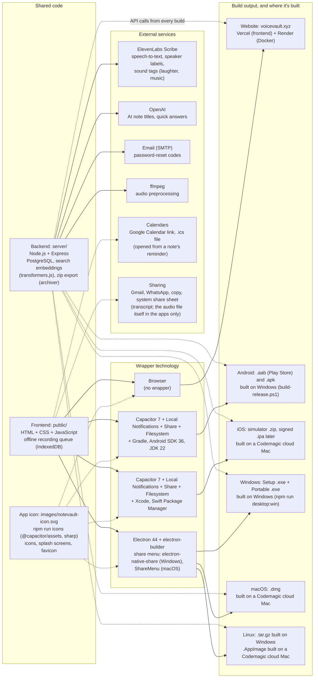

# NoteVault — Project Report

## Overview
`NoteVault` is the **app version** of the voiceVault web app, for **Android and iOS** (Capacitor) and **Windows, macOS and Linux** (Electron). It lets users **record audio notes**, have them **transcribed**, and **search across notes** from a phone or computer. It shares the same account, notes, and backend as the website — anything saved on the website shows up in the app and vice versa.

It lives in its own folder (`D:\Projects\NoteVault`), separate from the web project, so app work cannot break the live website.

## Screenshot


More screenshots are in `NoteVault_project-report.md` and the `images/` folder.

## Core Features
- **In-app recording**: Uses the phone microphone (WebView `MediaRecorder`; `RECORD_AUDIO` permission). Records WebM/Opus, or MP4/AAC where WebM isn't supported.
- **Cloud storage**: Notes and audio are stored by the live backend (`https://api.voicevault.xyz`) in Render PostgreSQL — not on the phone.
- **Transcription**: Done on the server (ElevenLabs Scribe by default, or local faster-whisper), with timestamped segments.
- **Speaker labels and sound tags**: note transcripts mark who spoke each line ("Speaker 1:", "Speaker 2:") and tag sounds such as laughter or music. Speakers can be renamed before saving and in Edit mode.
- **Search**: Text and voice search, hybrid keyword + semantic retrieval, natural-language and date filters.
- **Accounts**: Email/password login, forgot-password by email OTP, profile + avatar, in-app account deletion (needed for Google Play and the App Store). After 3 wrong passwords, login waits 30 seconds (with a countdown) before the next 3 tries.
- **Record without internet**: recordings saved offline wait on the device and upload when the connection returns.
- **Reminders**: a note can have a reminder date and time; the Android and iOS apps show a phone notification, and every build offers "Add to Google Calendar" and an `.ics` file.
- **Export all notes**: one `.zip` with every note's transcript and audio, named after the note titles (Profile, beside Edit).
- **Share a note**: send just the transcript, just the audio, or both, by Copy, Gmail, WhatsApp or the phone's share menu. Audio is sent as the audio file itself, through the phone's or computer's share menu (the Linux app downloads it ready to attach). The website shares the transcript only.
- **App icon**: NoteVault's own icon (a note page where a sound wave turns into handwriting, with a pen and a vault badge) on the home screen, splash screen and desktop apps.
- **Newest label**: the most recent note is marked "Newest" at the bottom right of its card.
- **Auto-sync**: The saved-notes list re-checks the server every 15 seconds (and when the app returns to the foreground) and re-renders only if something changed.
- **Organisation**: Starred notes pinned to the top, folders, tags, saved searches.

## Tech Stack
- **App shell**: Capacitor 7 (Android WebView wrapping `public/`), with the Local Notifications plugin for reminders
- **Frontend**: Vanilla HTML/CSS/JS in `public/` (copied from the web project, with app-specific API routing)
- **API routing**: `public/mobile-api.js` rewrites `/api/*` requests to `https://api.voicevault.xyz`
- **Backend (shared with website)**: Node.js + Express on Render (Docker, Singapore), PostgreSQL on Render
- **Build tools**: Android SDK (API 36), JDK 22, Gradle

### Technology and build map

The voiceVault website and the NoteVault apps share one frontend (`public/`) and one backend (`api.voicevault.xyz`). Each build wraps the same frontend with a different technology. The app wrappers (Capacitor, Electron) live in the NoteVault project (`D:\Projects\NoteVault`, GitHub `1218Anubhavmishra/NoteVault`). The backend calls **ElevenLabs Scribe** to turn recorded audio into text (word timestamps, language detection, who spoke each line, and sound tags such as laughter or music; `server/elevenlabs-stt-vv.js`, key `ELEVENLABS_API_KEY`). A local faster-whisper model is an optional alternative (`VOICEVAULT_STT_PROVIDER=whisper`). OpenAI generates note titles and quick answers when `OPENAI_API_KEY` is set, SMTP email sends password-reset codes, and ffmpeg prepares audio before transcription. Search embeddings run locally on the server (transformers.js), so search needs no external API.



## Repository Structure (high-level)
- `public/`: App UI (same UI as the website + `mobile-api.js`)
- `android/`: Native Android project generated by Capacitor
- `server/`: Copy of the backend (the app uses the live Render backend, not this copy)
- `android-signing/`: Upload key + password (**secret; never commit; back up**)
- `release/`: Signed release builds (AAB + APK)
- `*.ps1`: Build / emulator / install scripts
- `docs/`: reports, `.docx` copies and notes; `images/`: screenshots and the technology chart image

## Build & Run (Windows)
### Debug build on the emulator
```powershell
.\start-emulator.ps1        # starts the flutter_emulator AVD
.\build-android.ps1         # builds NoteVault-debug.apk
.\install-sideload.ps1      # waits for boot, installs, launches
```

### Release build (Google Play)
```powershell
.\build-release.ps1
```
Outputs:
- `release\NoteVault-release.aab` — upload to Play Console
- `release\NoteVault-release.apk` — direct install

### Desktop and iOS builds
```powershell
npm run desktop:win      # Windows installer + portable .exe
npm run desktop:linux    # Linux .tar.gz
npm run cap:sync:ios     # prepare ios/ before a Codemagic iOS build
```
The macOS `.dmg`, Linux `.AppImage` and iOS builds come from Codemagic workflows (`codemagic.yaml`). All current build files are collected in `builds\`.

## Key App Settings
- **Package id**: `xyz.voicevault.app` (must never change once published)
- **App name**: NoteVault
- **Version**: 1.0 (versionCode 1)
- **Min / target Android**: 6.0 (API 23) / 16 (API 36)

## Data & Persistence
- All user data lives in the Render PostgreSQL database shared with the website.
- Reinstalling or redeploying the app does not delete data; deleting the Render database does.

## Risks / Constraints
- Needs an internet connection (no offline mode).
- Depends on the Render backend being up and `VOICEVAULT_CROSS_SITE_COOKIES=1` set there (otherwise login fails with `AUTH_REQUIRED`).
- Losing the upload key makes updates difficult (Play App Signing reset needed).
- iOS builds require a Mac (or Codemagic cloud Mac); publishing needs an Apple Developer account.
- Desktop builds are not code-signed, so Windows and macOS warn on first run.
